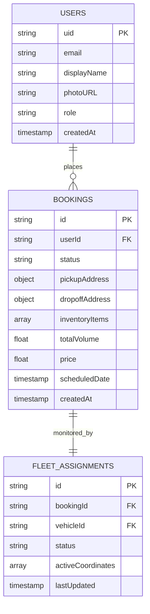
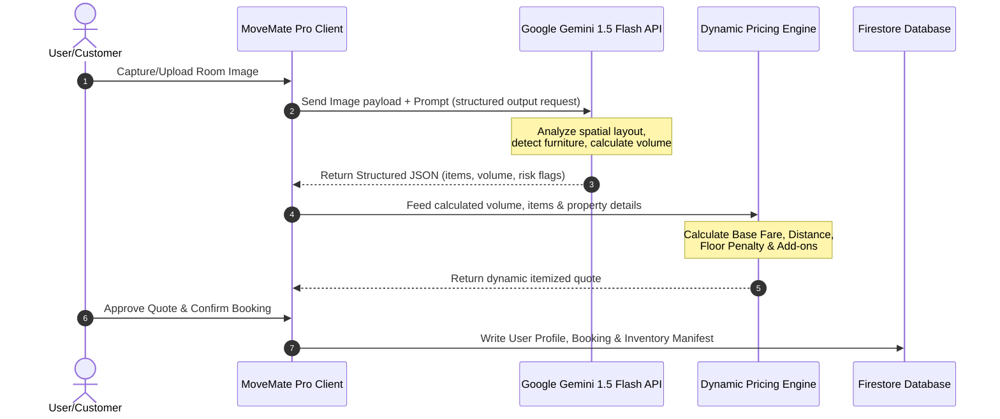

# 🚚 MoveMate Pro

**A premium, AI-powered Progressive Web App (PWA) for modernizing moving and logistics services.**

MoveMate Pro reimagines the moving experience with a sleek mobile-first interface, intelligent AI inventory scanning, real-time pricing, and seamless operational coordination — all wrapped in a beautiful, tactile design system.

---

## 📖 Project Overview

MoveMate Pro is a comprehensive digital platform designed to solve the real-world complexities of moving and logistics. It serves as an end-to-end ecosystem that helps users manage their moving operations efficiently, from calculating inventory volume to tracking fleet operations. By bridging the gap between customers and logistics providers, the platform streamlines everything from initial quotes and inventory logging to real-time fleet coordination.

## ⚠️ Problem Statement

Traditional moving and logistics workflows are plagued by manual, time-consuming processes. Customers struggle to accurately estimate their inventory, leading to pricing disputes and logistical bottlenecks. Furthermore, lack of visibility into fleet operations, inefficient coordination between drivers and dispatchers, and fragmented communication systems create a stressful experience for both businesses and end-users. 

## 💡 Solution

MoveMate Pro addresses these challenges by introducing a unified, modern digital platform. It eliminates the guesswork in inventory management through AI-powered vision scanning, provides instant and transparent pricing, and offers a centralized dashboard for fleet tracking. By combining intuitive consumer-facing interfaces with robust operational tools, MoveMate Pro transforms a chaotic process into a predictable, transparent, and seamless experience.

---

## 🏗️ Application Structure

MoveMate Pro is designed with a dual-environment architecture to serve different user journeys securely and efficiently:

* **Public-Facing Website**: A dynamic, highly-optimized landing environment designed to convert visitors. It showcases the platform's capabilities, explains the core infrastructure, provides pricing insights, and allows potential customers to explore services before committing.
* **Secure Authenticated Application**: Accessible exclusively via Google Sign-In, this is the operational heart of the platform. Once authenticated, users enter a secure mobile-first application shell where they can manage their bookings, interact with the AI inventory scanner, configure profile security, and access the logistics dashboard.

These environments share a unified design language but are structurally separated to ensure maximum security for user data while maintaining blazing-fast load times for public marketing pages.

### 🗃️ Database Schema & Data Models

To ensure clean engineering structure and reliable data mapping, Firestore collections follow a highly structured entity relationship model:



---

## ✨ Core Features

* **User Authentication**: Secure, token-based authentication flow powered by Firebase, ensuring all user data, saved locations, and moving manifests remain private.
* **User Dashboard**: A centralized command center for users to initiate new moves, track active logistics, and view high-level AI statistics of their inventory.
* **Booking Management**: A step-by-step guided wizard allowing users to select move types, set pickup/drop-off locations, specify property constraints (e.g., elevators, parking), and receive transparent, real-time pricing.
* **Fleet Command**: An operational overview module that allows users and administrators to monitor fleet activity.
* **Inventory Management**: Advanced tools to catalog items, categorize fragile goods, and calculate spatial requirements.
* **Analytics and Operational Tools**: Real-time pricing calculations, distance estimations, and dynamic scheduling.
* **Responsive Design and User Experience**: A glassmorphism-inspired, mobile-first UI with tactile button responses, fluid micro-animations (via Framer Motion), and premium aesthetic choices.

---

## 🤖 AI Inventory (Featured Innovation)

One of the most prominent innovations within MoveMate Pro is the **Vision AI Engine**. 

Instead of manually counting boxes and measuring furniture, users can leverage a live camera workflow or upload photos of their space. The system utilizes **Google Gemini 1.5 Flash** vision models to instantly analyze the spatial depth and identify objects. 

* **Automated Cataloging**: Detects furniture, electronics, and boxes automatically.
* **Risk Assessment**: Highlights potentially fragile items requiring special care.
* **Volume Calculation**: Estimates the cubic meter (m³) requirements for the detected items.
* **Business Impact**: This drastically reduces the manual effort required for quoting, eliminates human error in volume estimation, and provides logistics teams with accurate spatial data before a truck is even dispatched.

### 🔄 AI Data Flow Architecture

The dynamic process from initial photo capture to direct Firestore logging runs as a structured asynchronous pipeline:



#### Detailed Ingestion Pipeline

1. **Capture/Upload**: The customer captures or uploads a room image/video on the **MoveMate Pro Client**.
2. **Vision Processing**: The **MoveMate Pro Client** sends the raw image payload along with a structured prompt context to the **Google Gemini 1.5 Flash API**.
3. **Spatial Analysis**: The **Google Gemini 1.5 Flash API** processes the frame, detects the various furniture types, assesses spatial depth, and flags fragile items.
4. **Structured Mapping**: The **Google Gemini 1.5 Flash API** returns a structured JSON payload detailing identified items, item counts, estimated cubic volume ($m^3$), and fragile risk flags.
5. **Pricing Formulation**: The **MoveMate Pro Client** feeds this data alongside user inputs (distance, floors, elevators) directly into the **Dynamic Pricing Engine**.
6. **Real-time Quote**: The **Dynamic Pricing Engine** calculates standard base fares, dynamic distance rates, floor height handling charges, and toggled add-ons, returning an itemized quote.
7. **Approval**: The **Customer** reviews the transparent pricing, clicks approve, and confirms the booking.
8. **Firestore Ledger**: The **MoveMate Pro Client** registers the finalized transaction and writes the structured **User Profile, Booking Details, and Inventory Manifest** into the **Firestore Database**.

---

## 🚛 Fleet Command

The Fleet Command module is designed for absolute visibility over logistics operations. 

* **Monitoring Capabilities**: Tracks active moving operations and categorizes them by status (Pending, Confirmed, In Transit).
* **Operational Coordination**: Provides dispatchers and users with insights into pickup and drop-off coordinates, estimated time windows, and contract values.
* **Workflow Support**: By centralizing this data, the module prevents scheduling conflicts and ensures that the right fleet size is dispatched based on the AI-calculated inventory volume.

---

## 🎛️ User Dashboard

Upon logging in, users are greeted by a sleek, personalized operational dashboard. 

* **Available Modules**: Access to the AI Core statistics, Active Logistics tracking, Vision AI deployment, and Vault (media file uploads).
* **User Workflows**: Users can easily jump into a new booking, check the status of an ongoing move, or update their premium profile settings.
* **Centralization**: The dashboard perfectly bridges the gap between initiating a new order and managing existing logistics, putting all necessary tools just one tap away.

---

## 🏗️ Project Architecture

```text
movemate-pro/
├── src/
│   ├── app/
│   │   ├── page.tsx                 # Dashboard & Home Page
│   │   ├── layout.tsx               # Root layout & providers
│   │   ├── globals.css              # Design system & CSS tokens
│   │   ├── reviews/page.tsx         # Client Testimonials Grid
│   │   ├── fleet-monitor/page.tsx   # Fleet Telematics Dashboard
│   │   ├── scanner/page.tsx         # Standalone AI Camera Scanner
│   │   ├── profile/page.tsx         # User Profile Settings
│   │   ├── bookings/page.tsx        # Bookings & Move Logs
│   │   ├── book/                    # Booking Wizard Flow
│   │   │   ├── page.tsx             # Booking controller
│   │   │   └── steps/               # Wizard Steps (Location, Inventory, Payment, etc.)
│   ├── components/
│   │   ├── BackgroundSlider.tsx     # Animated Hero Slider
│   │   ├── CameraScanner.tsx        # Reusable AI vision component
│   │   ├── NavigationShell.tsx      # Sidebar/Mobile navigation wrapper
│   │   └── DashboardHeader.tsx      # Client dashboard header
│   └── lib/
│       ├── firebase.ts              # Firebase initialization
│       ├── booking-context.tsx      # Global booking state
│       ├── firestore.ts             # Database operations
│       └── pricing.ts               # Core pricing logic
└── package.json
```

---

## 🛠️ Technologies Used

MoveMate Pro is built on a modern, enterprise-grade technology stack:

| Domain | Technology | Purpose |
|---|---|---|
| **Framework** | [Next.js](https://nextjs.org/) (App Router) | Server/client rendering, routing, API endpoints |
| **Language** | [TypeScript](https://www.typescriptlang.org/) | Type-safe enterprise development |
| **Styling** | [Tailwind CSS](https://tailwindcss.com/) | Utility-first CSS with custom design tokens |
| **Animations** | [Framer Motion](https://www.framer.com/motion/) | Complex transition states and micro-interactions |
| **Data Viz** | [Recharts](https://recharts.org/) | Real-time telemetry rendering for the Fleet Monitor |
| **Icons** | [Lucide React](https://lucide.dev/) | Consistent, scalable SVG iconography |
| **AI / ML** | [Google Gemini 1.5](https://ai.google.dev/) | Vision-based inventory scanning and AI fleet reports |
| **Payments** | [Stripe](https://stripe.com/) | Secure checkout and payment processing |
| **Auth & DB** | [Firebase](https://firebase.google.com/) | Authentication, Firestore database, and Hosting |

---

## 🌍 Project Impact

MoveMate Pro proves that traditional, paper-heavy industries can be completely revitalized through thoughtful software design. By automating inventory calculation via AI, the application reduces the time required to generate a quote from hours to seconds. It replaces fragmented communication with a single source of truth, drastically improving the organizational efficiency of moving companies and offering customers an unparalleled, stress-free experience.

---

## 🚀 Getting Started

### Prerequisites

- **Node.js** ≥ 18
- **npm** ≥ 9
- **Firebase** Project (Auth & Firestore)
- **Stripe** Account (Publishable & Secret Keys)
- **Google Gemini** API Key

### Environment Setup

Create a `.env.local` file in the project root:

```env
# Firebase Configuration
NEXT_PUBLIC_FIREBASE_API_KEY=your_firebase_api_key
NEXT_PUBLIC_FIREBASE_AUTH_DOMAIN=your_project.firebaseapp.com
NEXT_PUBLIC_FIREBASE_PROJECT_ID=your_project_id

# AI & Mapping
GEMINI_API_KEY=your_gemini_api_key
NEXT_PUBLIC_GOOGLE_MAPS_KEY=your_google_maps_key

# Payments
NEXT_PUBLIC_STRIPE_PUBLISHABLE_KEY=pk_test_...
STRIPE_SECRET_KEY=sk_test_...
```

### Installation & Execution

```bash
# Clone and install dependencies
git clone <your-repo-url>
cd movemate-pro
npm install

# Run the development server
npm run dev
```

Open [http://localhost:3000](http://localhost:3000) in your browser to view the application.

---

<p align="center">
  Built with ❤️ using Next.js, Stripe, & Google Gemini AI
</p>
